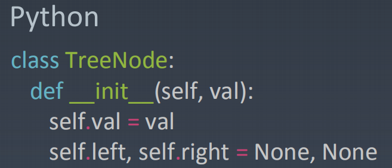
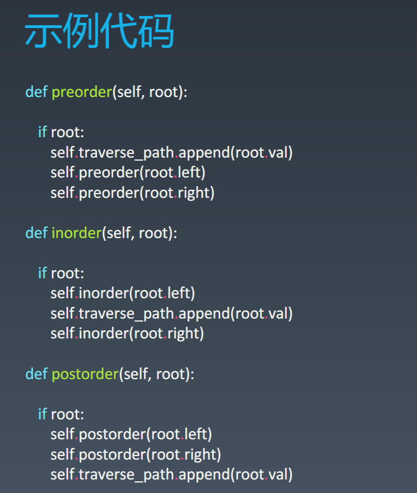

学习笔记

哈希表（Hashtable），也叫散列表，是根据关键码值（Keyvalue）而直接进行访问的数据结构。它通过把关键码值映射到表中一个位置来访问记录，以加快查找的速度。这个映射函数叫作散列函数（HashFunction），存放记录的数组叫作哈希表（或散列表）。

Linked List 是特殊化的TreeTree 是特殊化的Graph

二叉树遍历Pre-order/In-order/Post-order

1.前序（Pre-order）：根-左-右

2.中序（In-order）：左-根-右

3.后序（Post-order）：左-右-根

二叉搜索树Binary Search Tree

二叉搜索树，也称二叉排序树、有序二叉树（OrderedBinary Tree）、排序二叉树（SortedBinary Tree），是指一棵空树或者具有下列性质的二叉树：1. 左子树上所有结点的值均小于它的根结点的值；2. 右子树上所有结点的值均大于它的根结点的值；3. 以此类推：左、右子树也分别为二叉查找树。（这就是重复性！）

中序遍历：升序排列

