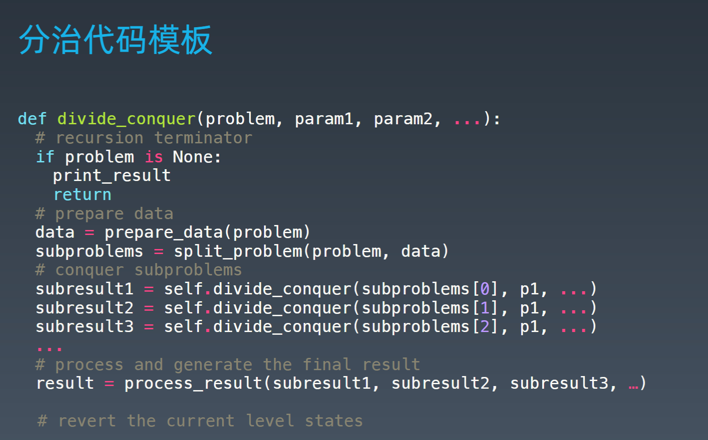

学习笔记

递归 Recursion

递归 - 循环 

通过函数体来进行的循环


案例

计算 n! 

n！= 1 * 2 * 3 * ... * n 

```python
defFactorial(n):
    if n <=1: 
        return 1
     return n *Factorial(n —1)
```


思维要点

1.不要人肉进行递归（最大误区） 

2.找到最近最简方法，将其拆解成可重复解决的问题（重复子问题） 

3.数学归纳法思维


# **分治**

分治其实就是递归，就是后面加了合成一下，通过代码模板可以清晰的看到，第三层递归后面多了一个合成所有结果。




